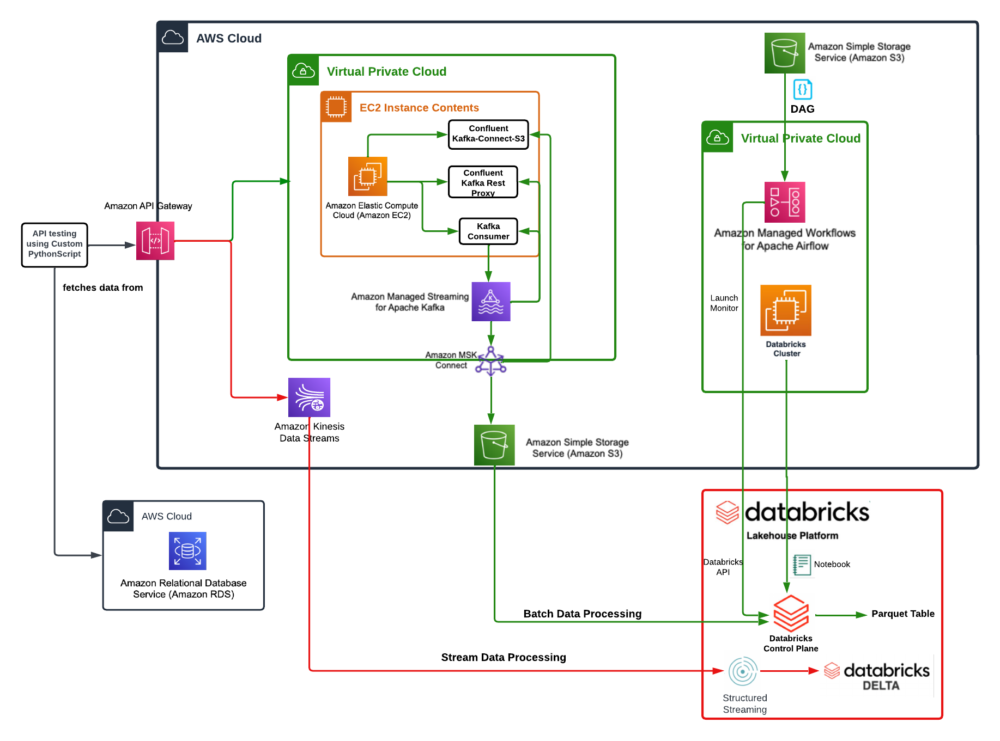

# pinterest-data-pipeline409


## Table of Contents
- [Project Overview](#project-overview)
- [Objectives](#objectives)
- [Description](#description)
- [File Structure](#file-structure)
- [Installation](#installation)
- [License](#license)

## Project Overview
This is a end to end AWS-hosted data pipeline inspired by Pinterest's experiment processing pipeline. The pipeline is developed using a Lambda architecture. 




## Description


## File Structure
    .
    ├── Databricks-Notebooks
    │   ├── Mount the S3 bucket to Databricks 2024-02-21 16_03_34.ipynb
    │   ├── Streaming_from_kinesis.ipynb
    │   └── clean_dataframe.ipynb
    ├── Images
    │   └── CloudPinterestPipeline.png
    ├── README.md
    ├── dag
    │   └── 0e284c63dbbf_dag.py
    ├── user_posting_emulation.py
    └── user_posting_emulation_streaming.py


## Installation
In order to view and use the report on your local machine, run this command in an appropriate directory:

   ``` bash
   git clone https://github.com/hameed0380/pinterest-data-pipeline409.git
   cd pinterest-data-pipeline409
   ```
